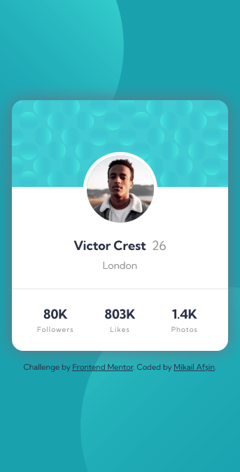
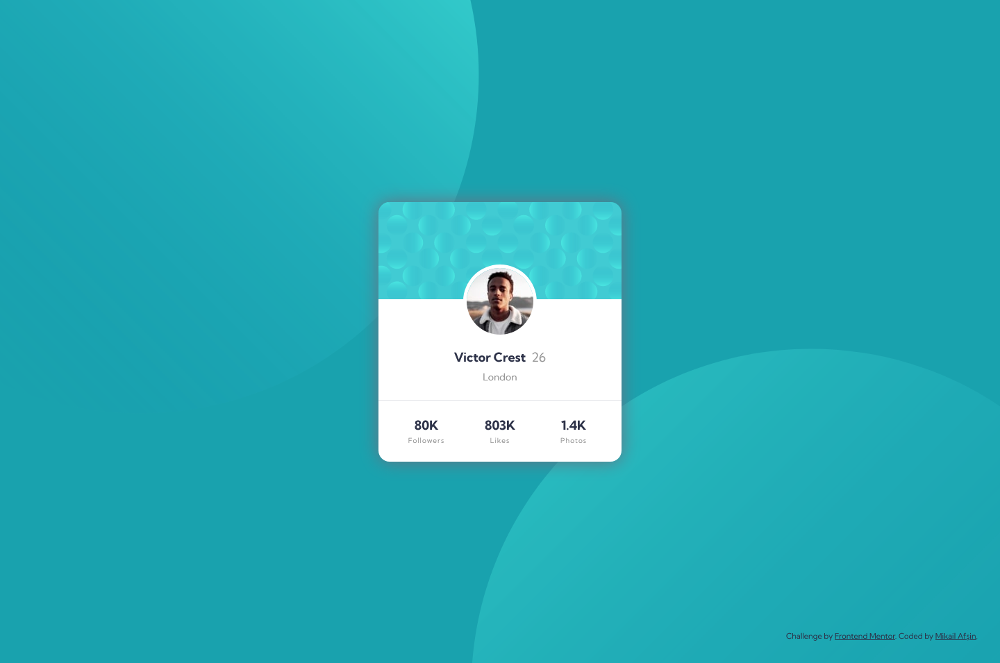

# Frontend Mentor - Profile card component solution

This is a solution to the [Profile card component challenge on Frontend Mentor](https://www.frontendmentor.io/challenges/profile-card-component-cfArpWshJ).

## Table of contents

- [Overview](#overview)
  - [The challenge](#the-challenge)
  - [Screenshot](#screenshot)
  - [Links](#links)
- [My process](#my-process)
  - [Built with](#built-with)
  - [What I learned](#what-i-learned)
  - [Continued development](#continued-development)
- [Author](#author)

## Overview

### The challenge

- Build out the project to the designs provided

### Screenshot

**Mobile**

**Desktop**

### Links

- Solution URL: [GitHub](https://github.com/mikailafsin/frontend-mentor-profile-card-component-solution)
- Live Site URL: [Vercel](https://frontend-mentor-profile-card-component-solution-seven.vercel.app)

## My process

### Built with

- HTML5 markup
- CSS custom properties
- Flexbox
- Mobile-first workflow
- [Sass](https://sass-lang.com) - CSS pre-processor
- [BEM](https://getbem.com) - Naming methodology

### What I learned

In this challenge, I practiced the techniques that I knew.

### Continued development

In future projects, I will focus on using all the techniques I used to solve this challenge and further develop these techniques.

## Author

- Frontend Mentor - [@mikailafsin](https://www.frontendmentor.io/profile/mikailafsin)
- Instagram - [@mikail.afsin](https://www.instagram.com/mikail.afsin)